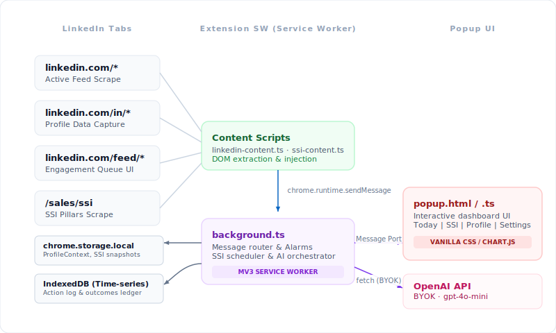
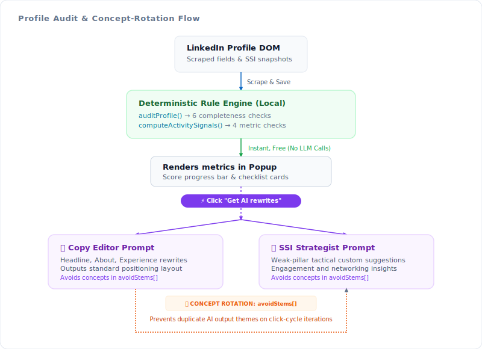

<!-- ═══════════════════════════════════════════════════════════════
     HERO — animated gradient wave banner
════════════════════════════════════════════════════════════════ -->

<a href="https://mrviduus.github.io/linkmate/" target="_blank">
  
</a>

<!-- CTA button — prominent, animated shimmer badge -->
<p align="center">
  <br/>
  <a href="https://mrviduus.github.io/linkmate/">
    
  </a>
  <br/><br/>
</p>

<!-- Tagline + badges -->
<p align="center">
  An intelligent, zero-backend, privacy-first AI agent built into your browser.<br/>
  Audits your profile, maps your metrics, and helps you post, engage, and grow — all locally.
</p>

<p align="center">
  
  &nbsp;
  
  &nbsp;
  
  &nbsp;
  
</p>

<br/>

<!-- ──────────────────────── METRICS ──────────────────────── -->

<table align="center" width="600">
  <tr>
    <td align="center" width="150" style="padding: 20px 10px; border: 1px solid #e2e8f0; border-radius: 12px;">
      <svg width="28" height="28" viewBox="0 0 24 24" fill="none" stroke="#38bdf8" stroke-width="2" stroke-linecap="round" stroke-linejoin="round"><path d="M22 11.08V12a10 10 0 1 1-5.93-9.14"/><polyline points="22 4 12 14.01 9 11.01"/></svg><br/><br/>
      <strong>355</strong><br/>
      <sub style="color:#64748b">Unit Tests</sub>
    </td>
    <td align="center" width="150" style="padding: 20px 10px; border: 1px solid #e2e8f0; border-radius: 12px;">
      <svg width="28" height="28" viewBox="0 0 24 24" fill="none" stroke="#a78bfa" stroke-width="2" stroke-linecap="round" stroke-linejoin="round"><path d="M21 16V8a2 2 0 0 0-1-1.73l-7-4a2 2 0 0 0-2 0l-7 4A2 2 0 0 0 3 8v8a2 2 0 0 0 1 1.73l7 4a2 2 0 0 0 2 0l7-4A2 2 0 0 0 21 16z"/><polyline points="3.27 6.96 12 12.01 20.73 6.96"/><line x1="12" y1="22.08" x2="12" y2="12"/></svg><br/><br/>
      <strong>28</strong><br/>
      <sub style="color:#64748b">Test Suites</sub>
    </td>
    <td align="center" width="150" style="padding: 20px 10px; border: 1px solid #e2e8f0; border-radius: 12px;">
      <svg width="28" height="28" viewBox="0 0 24 24" fill="none" stroke="#34d399" stroke-width="2" stroke-linecap="round" stroke-linejoin="round"><circle cx="12" cy="12" r="10"/><polyline points="12 6 12 12 16 14"/></svg><br/><br/>
      <strong>~5 Days</strong><br/>
      <sub style="color:#64748b">Build Time</sub>
    </td>
    <td align="center" width="150" style="padding: 20px 10px; border: 1px solid #e2e8f0; border-radius: 12px;">
      <svg width="28" height="28" viewBox="0 0 24 24" fill="none" stroke="#fb923c" stroke-width="2" stroke-linecap="round" stroke-linejoin="round"><line x1="12" y1="1" x2="12" y2="23"/><path d="M17 5H9.5a3.5 3.5 0 0 0 0 7h5a3.5 3.5 0 0 1 0 7H6"/></svg><br/><br/>
      <strong>$0.00</strong><br/>
      <sub style="color:#64748b">Backend Cost</sub>
    </td>
  </tr>
</table>

<br/>

---

<!-- ──────────────────────── THE IDEA ──────────────────────── -->

<h2>
  <svg width="20" height="20" viewBox="0 0 24 24" fill="none" stroke="#f59e0b" stroke-width="2" stroke-linecap="round" stroke-linejoin="round" style="vertical-align:middle;margin-right:8px"><circle cx="12" cy="12" r="10"/><line x1="12" y1="8" x2="12" y2="12"/><line x1="12" y1="16" x2="12.01" y2="16"/></svg>
  The Idea in 60 Seconds
</h2>

**The Problem:** LinkedIn uses a complex, opaque **Social Selling Index (SSI)** score — spanning *Brand, Finding, Engaging, and Relationships* — to rank every account. It tells you *what* your score is, but never *how* to change it. Most users guess. The lucky ones grind for hours.

**The Solution:** **LinkMate** is a local-first Chrome Extension that parses your profile and SSI score, instantly surfaces optimization gaps and weekly quotas, then drafts targeted posts and replies in your own voice. **No data ever leaves your browser** except the prompts you send directly to OpenAI with your own key (BYOK).

---

<!-- ──────────────────────── BUILT BY ──────────────────────── -->

<h2>
  <svg width="20" height="20" viewBox="0 0 24 24" fill="none" stroke="#38bdf8" stroke-width="2" stroke-linecap="round" stroke-linejoin="round" style="vertical-align:middle;margin-right:8px"><path d="M17 21v-2a4 4 0 0 0-4-4H5a4 4 0 0 0-4 4v2"/><circle cx="9" cy="7" r="4"/><path d="M23 21v-2a4 4 0 0 0-3-3.87"/><path d="M16 3.13a4 4 0 0 1 0 7.75"/></svg>
  Built By
</h2>

We built LinkMate to make organic LinkedIn growth effortless, transparent, and completely private.

<table align="center" style="border:none;">
  <tr>
    <td align="center" width="160">
      <div style="background:#111827;border-radius:14px;padding:18px 16px;border:1px solid rgba(148,163,184,0.12);width:120px;">
        <span style="background:rgba(99,102,241,0.12);color:#818cf8;font-weight:700;font-size:16px;letter-spacing:0.05em;border-radius:50%;width:46px;height:46px;display:inline-flex;align-items:center;justify-content:center;margin-bottom:10px;">SH</span><br/>
        <b style="color:#e2e8f0;">Shyamal</b><br/>
        <sub style="color:#64748b;">AI Pipeline</sub>
      </div>
    </td>
    <td align="center" width="160">
      <div style="background:#111827;border-radius:14px;padding:18px 16px;border:1px solid rgba(148,163,184,0.12);width:120px;">
        <span style="background:rgba(99,102,241,0.12);color:#818cf8;font-weight:700;font-size:16px;letter-spacing:0.05em;border-radius:50%;width:46px;height:46px;display:inline-flex;align-items:center;justify-content:center;margin-bottom:10px;">VA</span><br/>
        <b style="color:#e2e8f0;">Vasyl</b><br/>
        <sub style="color:#64748b;">Engine Design</sub>
      </div>
    </td>
    <td align="center" width="160">
      <div style="background:#111827;border-radius:14px;padding:18px 16px;border:1px solid rgba(148,163,184,0.12);width:120px;">
        <span style="background:rgba(99,102,241,0.12);color:#818cf8;font-weight:700;font-size:16px;letter-spacing:0.05em;border-radius:50%;width:46px;height:46px;display:inline-flex;align-items:center;justify-content:center;margin-bottom:10px;">HO</span><br/>
        <b style="color:#e2e8f0;">Houman</b><br/>
        <sub style="color:#64748b;">UI / UX</sub>
      </div>
    </td>
    <td align="center" width="160">
      <div style="background:#111827;border-radius:14px;padding:18px 16px;border:1px solid rgba(148,163,184,0.12);width:120px;">
        <span style="background:rgba(99,102,241,0.12);color:#818cf8;font-weight:700;font-size:16px;letter-spacing:0.05em;border-radius:50%;width:46px;height:46px;display:inline-flex;align-items:center;justify-content:center;margin-bottom:10px;">DA</span><br/>
        <b style="color:#e2e8f0;">David</b><br/>
        <sub style="color:#64748b;">Verification</sub>
      </div>
    </td>
  </tr>
</table>

---

<!-- ──────────────────────── CORE FEATURES ──────────────────────── -->

<h2>
  <svg width="20" height="20" viewBox="0 0 24 24" fill="none" stroke="#a78bfa" stroke-width="2" stroke-linecap="round" stroke-linejoin="round" style="vertical-align:middle;margin-right:8px"><polygon points="12 2 15.09 8.26 22 9.27 17 14.14 18.18 21.02 12 17.77 5.82 21.02 7 14.14 2 9.27 8.91 8.26 12 2"/></svg>
  Core Features
</h2>

<table width="100%">
  <tr>
    <td width="50%" valign="top" style="padding:18px 20px;background:#111827;border:1px solid rgba(148,163,184,0.1);border-left:3px solid #4f6ef7;border-radius:10px;">
      <h3 style="margin-top:0;color:#c7d2fe;font-size:14px;letter-spacing:0.02em;display:flex;align-items:center;gap:8px;">
        <svg width="16" height="16" viewBox="0 0 24 24" fill="none" stroke="currentColor" stroke-width="2" stroke-linecap="round" stroke-linejoin="round"><line x1="18" y1="20" x2="18" y2="10"/><line x1="12" y1="20" x2="12" y2="4"/><line x1="6" y1="20" x2="6" y2="14"/></svg>
        SSI Tracker
      </h3>
      <p style="color:#94a3b8;font-size:13px;line-height:1.65;margin:0;">Daily scrape of <code>/sales/ssi</code> stores score movements, 4 component sub-metrics, and industry rankings into a local 90-day ring buffer.</p>
    </td>
    <td width="50%" valign="top" style="padding:18px 20px;background:#111827;border:1px solid rgba(148,163,184,0.1);border-left:3px solid #4f6ef7;border-radius:10px;">
      <h3 style="margin-top:0;color:#c7d2fe;font-size:14px;letter-spacing:0.02em;display:flex;align-items:center;gap:8px;">
        <svg width="16" height="16" viewBox="0 0 24 24" fill="none" stroke="currentColor" stroke-width="2" stroke-linecap="round" stroke-linejoin="round"><path d="M12 22s8-4 8-10V5l-8-3-8 3v7c0 6 8 10 8 10z"/></svg>
        Profile Audit
      </h3>
      <p style="color:#94a3b8;font-size:13px;line-height:1.65;margin:0;">Checks 6 LinkedIn All-Star completeness criteria and 4 activity signals. Built on a fully local, zero-cost rules check pipeline.</p>
    </td>
  </tr>
  <tr>
    <td width="50%" valign="top" style="padding:18px 20px;background:#111827;border:1px solid rgba(148,163,184,0.1);border-left:3px solid #4f6ef7;border-radius:10px;">
      <h3 style="margin-top:0;color:#c7d2fe;font-size:14px;letter-spacing:0.02em;display:flex;align-items:center;gap:8px;">
        <svg width="16" height="16" viewBox="0 0 24 24" fill="none" stroke="currentColor" stroke-width="2" stroke-linecap="round" stroke-linejoin="round"><polygon points="12 2 15.09 8.26 22 9.27 17 14.14 18.18 21.02 12 17.77 5.82 21.02 7 14.14 2 9.27 8.91 8.26 12 2"/></svg>
        AI Rewrites &amp; Rotation
      </h3>
      <p style="color:#94a3b8;font-size:13px;line-height:1.65;margin:0;">Runs parallel copy-editor and strategy prompts. Avoids concept repetition across click cycles using <code>avoidStems</code> logic blocks.</p>
    </td>
    <td width="50%" valign="top" style="padding:18px 20px;background:#111827;border:1px solid rgba(148,163,184,0.1);border-left:3px solid #4f6ef7;border-radius:10px;">
      <h3 style="margin-top:0;color:#c7d2fe;font-size:14px;letter-spacing:0.02em;display:flex;align-items:center;gap:8px;">
        <svg width="16" height="16" viewBox="0 0 24 24" fill="none" stroke="currentColor" stroke-width="2" stroke-linecap="round" stroke-linejoin="round"><circle cx="12" cy="12" r="10"/><circle cx="12" cy="12" r="6"/><circle cx="12" cy="12" r="2"/></svg>
        Cadence &amp; Streak Quotas
      </h3>
      <p style="color:#94a3b8;font-size:13px;line-height:1.65;margin:0;">Set weekly custom-targets mapped to individual SSI metric gaps. Track consistency milestones via visual streak trackers.</p>
    </td>
  </tr>
  <tr>
    <td width="50%" valign="top" style="padding:18px 20px;background:#111827;border:1px solid rgba(148,163,184,0.1);border-left:3px solid #4f6ef7;border-radius:10px;">
      <h3 style="margin-top:0;color:#c7d2fe;font-size:14px;letter-spacing:0.02em;display:flex;align-items:center;gap:8px;">
        <svg width="16" height="16" viewBox="0 0 24 24" fill="none" stroke="currentColor" stroke-width="2" stroke-linecap="round" stroke-linejoin="round"><path d="M21 15a2 2 0 0 1-2 2H7l-4 4V5a2 2 0 0 1 2-2h14a2 2 0 0 1 2 2z"/></svg>
        Smart Reply Composer
      </h3>
      <p style="color:#94a3b8;font-size:13px;line-height:1.65;margin:0;">Injects custom reply triggers into LinkedIn post feeds. Formulates rich, context-aware comment drafts mirroring your own writing voice.</p>
    </td>
    <td width="50%" valign="top" style="padding:18px 20px;background:#111827;border:1px solid rgba(148,163,184,0.1);border-left:3px solid #4f6ef7;border-radius:10px;">
      <h3 style="margin-top:0;color:#c7d2fe;font-size:14px;letter-spacing:0.02em;display:flex;align-items:center;gap:8px;">
        <svg width="16" height="16" viewBox="0 0 24 24" fill="none" stroke="currentColor" stroke-width="2" stroke-linecap="round" stroke-linejoin="round"><path d="M21.5 2v6h-6M21.34 15.57a10 10 0 1 1-.57-8.38l5.67-5.67"/></svg>
        Closed-Loop Outcomes
      </h3>
      <p style="color:#94a3b8;font-size:13px;line-height:1.65;margin:0;">Implicitly tracks likes and comment engagements. Re-feeds actual user interaction data back into local prompt strategies automatically.</p>
    </td>
  </tr>
</table>

---

<!-- ──────────────────────── ARCHITECTURE ──────────────────────── -->

<h2>
  <svg width="20" height="20" viewBox="0 0 24 24" fill="none" stroke="#64748b" stroke-width="2" stroke-linecap="round" stroke-linejoin="round" style="vertical-align:middle;margin-right:8px"><rect x="3" y="3" width="18" height="18" rx="2"/><path d="M3 9h18M9 21V9"/></svg>
  System &amp; Design Architecture
</h2>

The core logic is split across three distinct layers — content scripts, a background service worker, and the popup UI — with all data persisted locally.

<h3>System Architecture</h3>

<p align="center">
  
</p>

<h3>Profile Audit &amp; Concept Rotation Flow</h3>

<p align="center">
  
</p>

<h3>Project Modules</h3>

| Module / File | Responsibility |
|---|---|
| `linkedin-content.ts` | Injects draft triggers into post compositions; mounts feed relevance queues |
| `ssi-content.ts` + `ssi-parser.ts` | Headless scraping of `linkedin.com/sales/ssi` metrics |
| `profile-parser.ts` + `profile-context.ts` | Captures profile context and manages user positioning summary |
| `profile-audit.ts` | Rule-check pipeline: 6 completeness conditions + 4 activity thresholds |
| `profile-audit-prompts.ts` | Structured JSON prompt builder with concept blacklist & rotation arrays |
| `profile-recommender.ts` | Executes and dedupes parallel LLM suggestions with fallback thresholds |
| `engagement-queue.ts` | Relevance scorer sorting feed posts based on profile topic overlap |
| `action-log.ts` + `cadence.ts` | Append-only IndexedDB metrics ledger recording streak patterns |

---

<!-- ──────────────────────── STORAGE ──────────────────────── -->

<h2>
  <svg width="20" height="20" viewBox="0 0 24 24" fill="none" stroke="#38bdf8" stroke-width="2" stroke-linecap="round" stroke-linejoin="round" style="vertical-align:middle;margin-right:8px"><ellipse cx="12" cy="5" rx="9" ry="3"/><path d="M21 12c0 1.66-4 3-9 3s-9-1.34-9-3"/><path d="M3 5v14c0 1.66 4 3 9 3s9-1.34 9-3V5"/></svg>
  Storage Layer
</h2>

Data is segmented into three storage systems to guarantee maximum privacy and O(log n) read performance:

<table width="100%">
  <tr>
    <td width="33%" valign="top" style="padding:16px;background:#0f172a;border:1px solid rgba(56,189,248,0.2);border-radius:10px;">
      <strong style="color:#38bdf8;">chrome.storage.local</strong><br/>
      <sub style="color:#64748b;display:block;margin:4px 0 10px;">Hot State</sub>
      Fast JSON key-value store for your decrypted OpenAI key, profile metrics, cached cards, and SSI history snapshots.
    </td>
    <td width="33%" valign="top" style="padding:16px;background:#0f172a;border:1px solid rgba(167,139,250,0.2);border-radius:10px;">
      <strong style="color:#a78bfa;">chrome.storage.sync</strong><br/>
      <sub style="color:#64748b;display:block;margin:4px 0 10px;">Cross-Device Sync</sub>
      Syncs non-sensitive preferences — customized prompts and generation parameters. <em>Secrets are never synced.</em>
    </td>
    <td width="33%" valign="top" style="padding:16px;background:#0f172a;border:1px solid rgba(52,211,153,0.2);border-radius:10px;">
      <strong style="color:#34d399;">IndexedDB</strong><br/>
      <sub style="color:#64748b;display:block;margin:4px 0 10px;">Time-Series Ledger</sub>
      Append-only action records and outcome logs. IndexedDB indices keep queries fast as records grow unbounded.
    </td>
  </tr>
</table>

---

<!-- ──────────────────────── INSTALL ──────────────────────── -->

<h2>
  <svg width="20" height="20" viewBox="0 0 24 24" fill="none" stroke="#34d399" stroke-width="2" stroke-linecap="round" stroke-linejoin="round" style="vertical-align:middle;margin-right:8px"><polyline points="16 16 12 12 8 16"/><line x1="12" y1="12" x2="12" y2="21"/><path d="M20.39 18.39A5 5 0 0 0 18 9h-1.26A8 8 0 1 0 3 16.3"/></svg>
  Install in 3 Steps
</h2>

**Step 1 — Build**

```bash
git clone https://github.com/mrviduus/linkmate.git
cd linkmate
npm install
npm run build
```

**Step 2 — Load the Extension**

1. Open Chrome and navigate to `chrome://extensions`
2. Enable **Developer mode** via the top-right toggle
3. Click **Load unpacked** and select the `dist/` folder

**Step 3 — Add your API Key**

Open the LinkMate popup via the extensions toolbar, go to **Settings**, paste your OpenAI API Key, and save.

---

<!-- ──────────────────────── CLI ──────────────────────── -->

<h2>
  <svg width="20" height="20" viewBox="0 0 24 24" fill="none" stroke="#94a3b8" stroke-width="2" stroke-linecap="round" stroke-linejoin="round" style="vertical-align:middle;margin-right:8px"><polyline points="4 17 10 11 4 5"/><line x1="12" y1="19" x2="20" y2="19"/></svg>
  CLI Reference
</h2>

| Command | Description |
|---|---|
| `npm run dev` | Interactive watch mode via Parcel |
| `npm run build` | Production extension bundle into `/dist` |
| `npm run zip` | Package release zip for distribution |
| `npm test` | Run all 355 unit tests across 28 suites |
| `npm run type-check` | Strict TypeScript compile audit |

---

<!-- ──────────────────────── LICENSE ──────────────────────── -->

<h2>
  <svg width="20" height="20" viewBox="0 0 24 24" fill="none" stroke="#94a3b8" stroke-width="2" stroke-linecap="round" stroke-linejoin="round" style="vertical-align:middle;margin-right:8px"><path d="M12 22s8-4 8-10V5l-8-3-8 3v7c0 6 8 10 8 10z"/></svg>
  License &amp; Disclaimers
</h2>

- **License:** ISC
- **LinkedIn ToS:** Draft generation is exclusively pre-fill. LinkMate never auto-submits, auto-clicks, or schedules actions on your behalf — keeping your account fully compliant.

---
